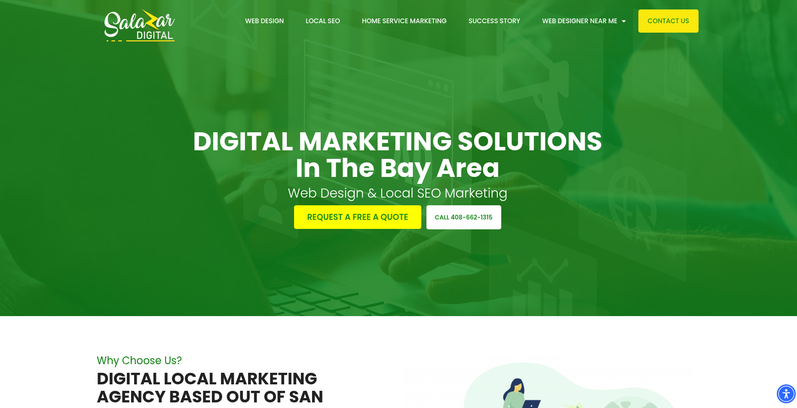

# Salazar Digital Theme



## Overview

The Salazar Digital theme is a custom child theme based on the Hello Elementor parent theme.  This choice was made due to the lightweight nature of the Hello Elementor theme.  Complex functionality was not really needed in the parent theme as this is an information website for the business.

This child theme extends the functionality of the parent theme by adding custom shortcodes, a customized footer, and additional style overrides to enhance the website’s design and usability.

## Features

### Custom Shortcodes

The custom-shortcodes.php file introduces a shortcode that allows for easy embedding of Vimeo videos within the portfolio section.

This shortcode simplifies the process of adding video content without manually inserting iframe code.

### Functions File

The functions.php adds customization options for the Wordpress Theme Customizer that allows for injection of the following details:

- Business phone number
- Business address
- Email address

### Custom Footer

The footer.php file provides cosmetic changes for the footer which are compatible with certain plugins used on the site that also override the footer.  The built in Elementor Theme Builder did not work well for this purpose.

### Theme Screenshot

The screenshot.png file serves as the visual representation of the child theme in the WordPress theme selector.

It provides a quick preview of the theme’s look and feel for easy identification.

### Custom Stylesheet

The style.css file includes CSS overrides that are better suited at the theme level rather than the Elementor page builder's built in CSS style management such as the vimeo embed shortcode.

## Installation

1. Download and Install the Hello Elementor Parent Theme (if not already installed).
2. Upload the child theme folder to wp-content/themes/ in your WordPress installation.
3. Activate the child theme from the WordPress Dashboard under Appearance > Themes.

## Usage

### Vimeo Embed Shortcode

Use the provided shortcode to embed Vimeo videos in portfolio sections.

```
[showvimeo]
```

Ensure that you set the Scrolling Video attribute in posts using the Portfolio custom post type which is managed by Pods and ACF plugins respectively.

### Customize Business Details

In the Wordpress dashboard, navigate to Appearance > Theme, and under the Salazar Digital theme, click customize.

Inside of this screen, you will find the "Salazar Digital Menu Settings" section.  There, you can change any details that you need which will affect the header and footer.

## Notes

- This child theme relies on Hello Elementor as the parent theme.
- For any further customizations, you may modify the PHP and CSS files as needed.